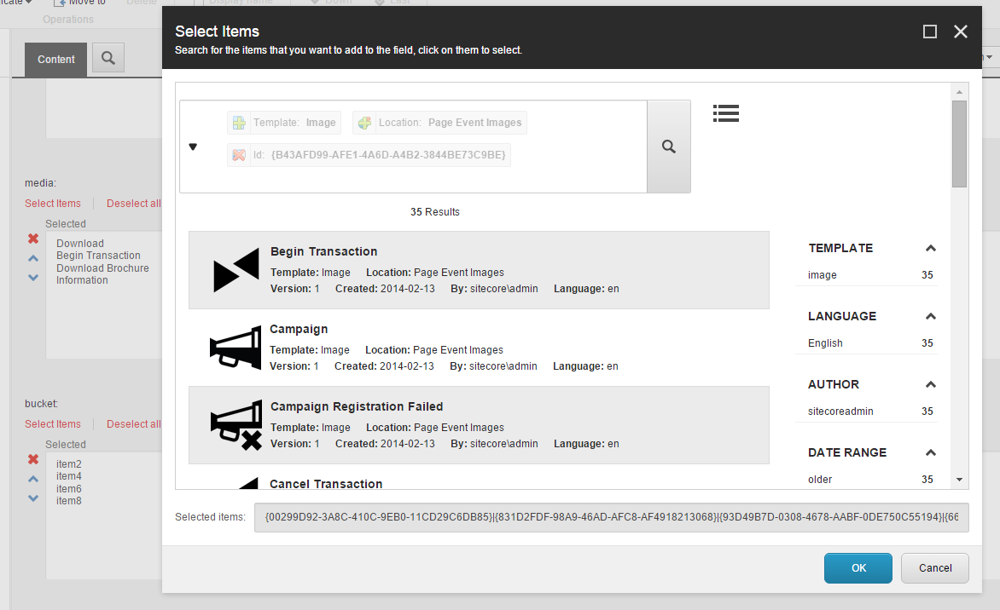

# Sitecore.Support.AdvancedSearchList
A field type which can be used as an alternative to the Multilist With Search

## Description
The new field type allows you to select an ordered list of items using a more convenient search dialog with extended filtering features (like facet search or search by a field):

The new field type supports the same data source parameters as `Multilist With Search` excepting:
**EnableSetNewStartLocation** - allows dynamic selection of the search location. This functionality is available in the new field type by default.
**PageSize** - used to enable paging. Is not required for the new field type as it uses continuous scroll bar.
**StartSearchLocation** - doesn't support fast queries.

## License  
This patch is licensed under the [Sitecore Corporation A/S License for GitHub](https://github.com/sitecoresupport/Sitecore.Support.AdvancedSearchList/blob/master/LICENSE).  

## Download  
Downloads are available via [GitHub Releases](https://github.com/sitecoresupport/Sitecore.Support.AdvancedSearchList/releases).  
